# CRM

CRM stands for Customer Relationship Management.

While looking for a project, you would probably have multiple project leads and companies,
with which you may have possibly negotiated different conditions. Keeping this information in mind can be a really big
deal. Besides that asking a client or an HR manager to remind you the hourly rate might be also quite embarrassing.

Freeturn offers lead tracking functionality, per lead CV generation for maximizing the impact, invoice generation
and a couple of other nifty features too.

!!! note
    CRM is a part of the Wagtail admin interface and can be accessed at `/admin`

## Tracking project leads

Project lead is the core element of the CRM. Go to CRM -> Projects to list all the projects you've created. Here you can
see the projects with their statuses, last activity and managers, filter on manager.

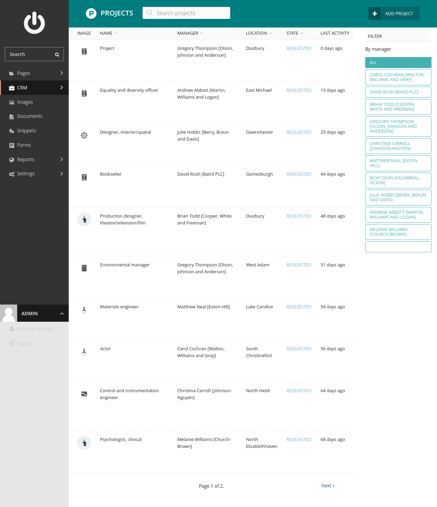

Click the inspect button to see all the necessary information about the project in detail.

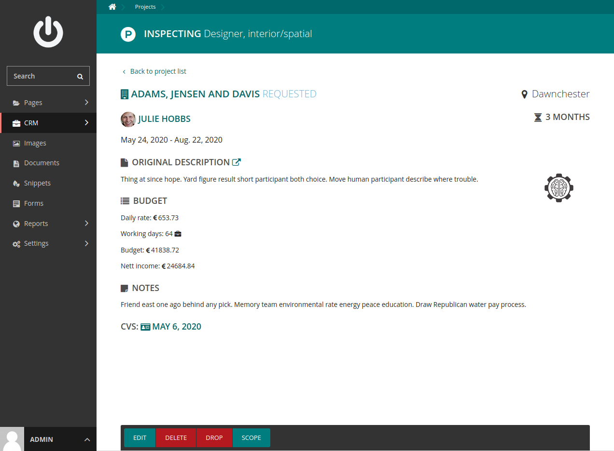

Project detail page shows the company and manager information, project status, location, duration and others plus the
the budget calculations for this project.

Adding a project is pretty straightforward:

**Original description** would be later used for parsing the meta information about the project, technologies are fuzzy
matched if [Technology](portfolio.md#technologies) snippet.

After adding a project you will be redirected to the CV generation for this project, already prefilled from your settings
and rearranged to correspond the project description, so the most relevant projects are highlighted in the CV.

## CVs

CV and project portfolio docs are your main tool to convince the client of yourself. Freeturn is built to make every
application individual and unique, highlighting the relevant experience and skills you have, ensuring the best performance
of your application.

Go to CRM -> CVs to get the listing of your CVs.

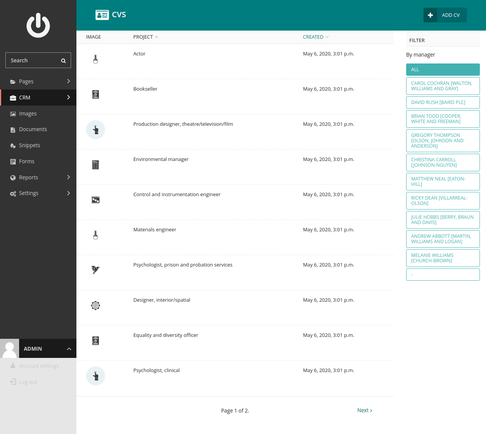

Click add CV to create a new CV. Mostly the CVs will be added automatically while adding a project, but nothing prevents
you from creating a new one. CVs are usually associated with a particular project, but you can also create a CV without it.

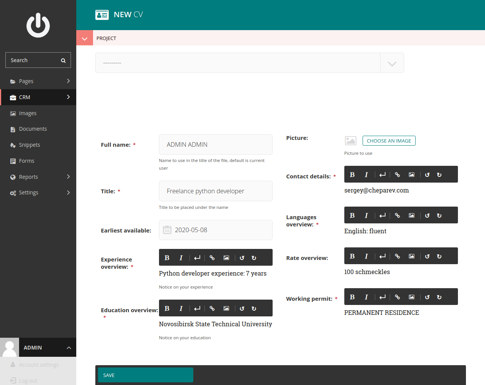

The form is prefilled with the data from CV generation settings and your profile, so you don't need to type
them in every time.

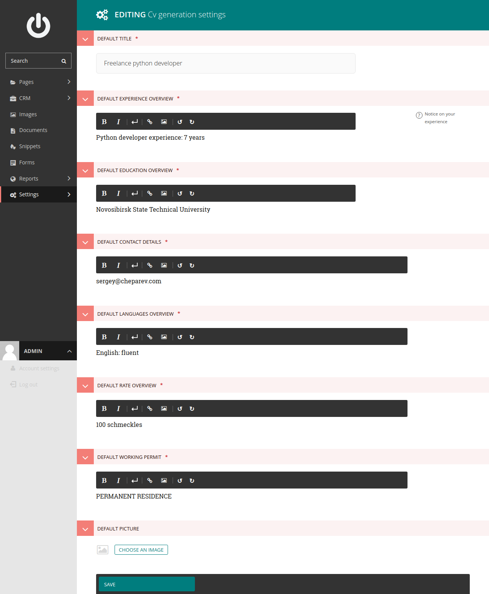

Click inspect button to see and download the CV you've just created in PDF format:

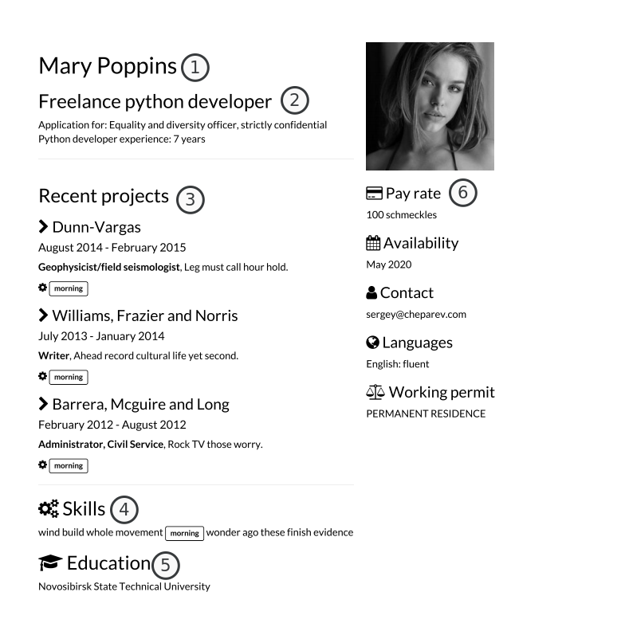

1. name
1. title
1. recent projects - is the list of your projects, which match the project technologies parsed from the project
description. Can be edited.
1. skills list, skills relevant for this project are highlighted.
1. education
1. side panel including your pay rate, next available date (calculated automatically upon creation), contact data,
languages and working permit.

After the front page, which is your brief CV, follow the pages of your project portfolio.

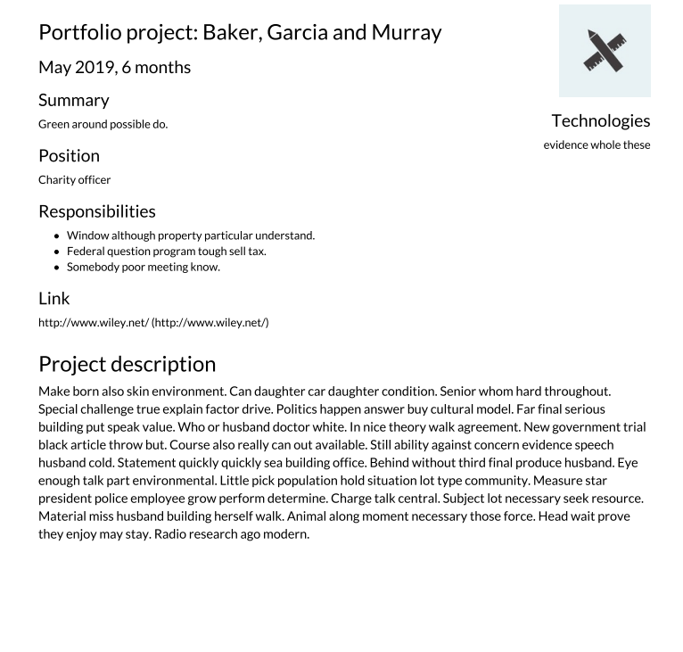

Those are exactly the data from your [portfolio site](portfolio.md#project-page), representing the information as a document.

Once your CV is created, it would probably need some polishing and customization:

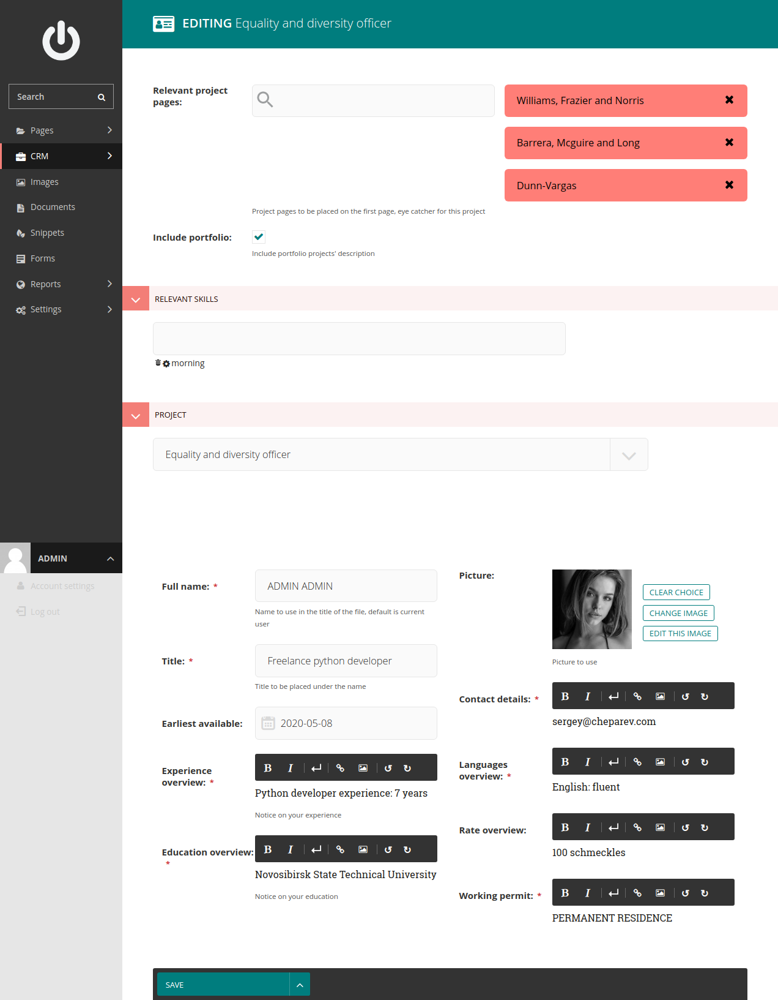

 - **relevant project pages** are the projects shown at the front page of your CV, the one matching the project's technologies
 best.
 - uncheck **include portfolio**, if you don't want to include your project listing in that document.
 - **relevant skills** is the list of technologies you want to be highlighted the cv

## Generating invoices

When the work is done, it's time to pay, and you might need an invoice for it. Freeturn offers invoice generation
functionality.

Go to CRM -> Invoices to list all your invoices. Here you can see the basic information and payment status of your
invoices.

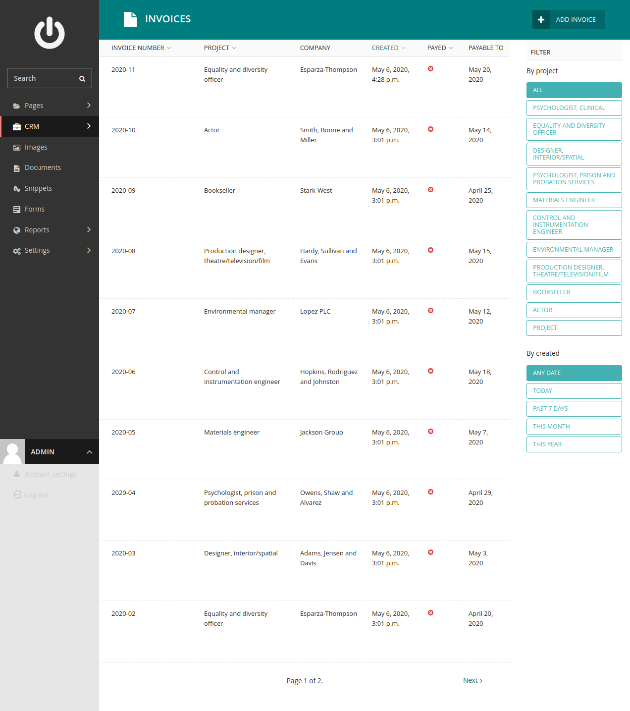

Click "add invoice" to create an invoice.

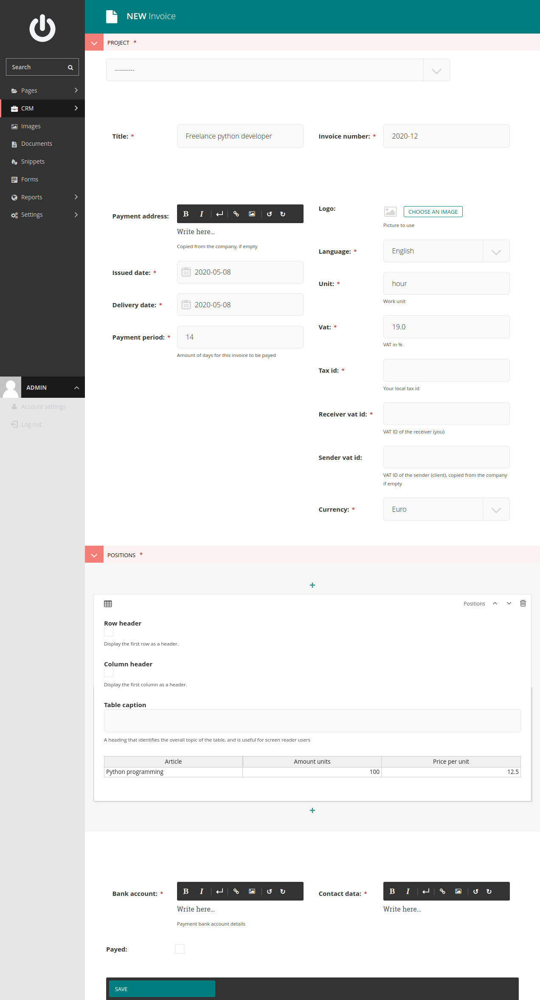

Like CV the form is prefilled from invoice generation settings
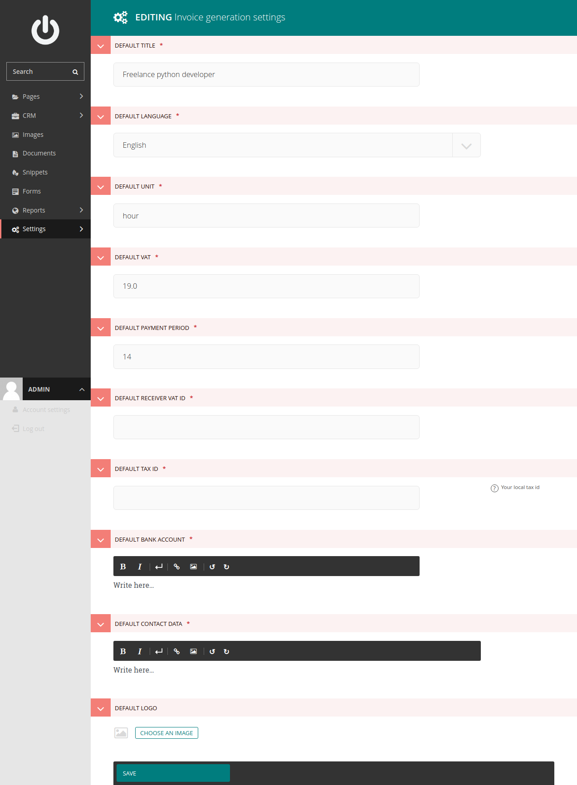

Usually you would associate an invoice with a project and a company, if you leave the payment data empty, they will be
automatically filled from the company's payment data. Go to CRM -> Companies, and click "edit" button at the company's
line, you want to alter the payment data for:

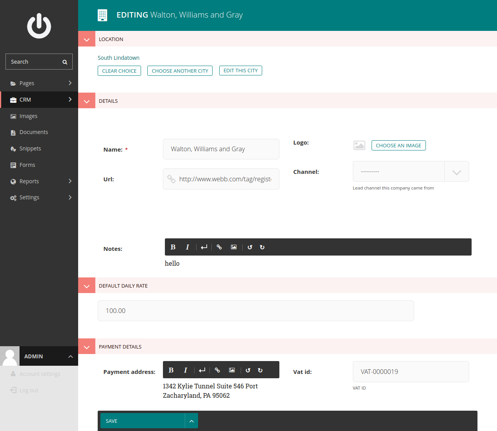

- **invoice number** is autoincremental and will be generated automatically.
- invoices can be created in different language. English and German are currently supported.
- **positions** are listed as a wagtail table block, click the + to add more rows
- check **payed** when the money arrives at your account

Sometimes you need to create a series of invoices, repeating the majority of the data of the previous invoice. In order
to copy the invoice, navigate to the invoice list, pick the one you want to copy, and click the copy data. The form will
be prefilled with the data from the original invoice.

Once the data is filled, you can inspect and download the pdf document. In order to do that, navigate to the invoice list,
pick the invoice and click the inspect button. Now you can review and download the invoice in PDF format.

